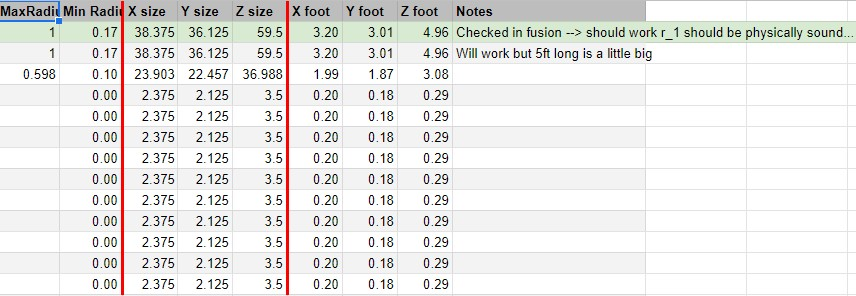

# image_to_sphere
Rendering 2d images into 3d environments of spheres in Unity using Python. Images are half-toned using a python program I built, then data about the location and radius of every circle is stored in CSV files. Next, a C# program I built reads the CSV file and creates spheres in a 3d environment where the Z axis position is defined relative to the size of any given sphere.
 
Here's an example of rendering a black and white image of a face into a 3d environment:
 
https://www.youtube.com/watch?v=JmCNsPvIqq4
 
The end result of this project is that I can run any black and white image through my programs and render a 3d-sphere display from the image. The human face environment in the video originated from a real picture of a man's face.
 
Lastly, I developed a workflow (with spreadsheets and querying the data using R) to list out the spheres in the environment from the top down as individual "strings," and standardize the sphere sizes to a discrete set of radii. This means that I can create spheres in all of these sizes (my workflow tells me how mnay to make) and use the lists of sphere-strings to know in what order I should hang these spheres. I plan to create a real-life installation of the man face environment using this method later this Spring.

Generated list of all spheres that will need to be created in the installation:
 

 
Generated list of all sphere sizes I will need to 3d print:
 

 
Table looking at the possible dimensions for the installation, given different possible scalings of the spheres:
 

 
I plan to physically install this project in my school's art gallery in the Spring of this year. The amount of technical planning that went into this project is more than I ever could have imagined. The theoretical side of this project (arguably the hardest part), is completed.
